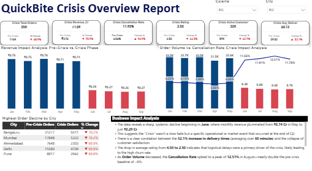

# Crisis Recovery Dashboard for QuickBite Express

## Project Overview

QuickBite Express experienced a business crisis that impacted customer activity and retention.

This project analyzes customer behavior before, during, and after the crisis to evaluate:

* Customer Retention
* Customer Churn
* New Customer Acquisition
* Recovery Performance
* Business Recovery Trends

The dashboard helps management understand the impact of the crisis and identify opportunities for customer recovery.

---

## Business Problem

During periods of disruption, businesses often experience:

* Loss of active customers
* Reduced engagement
* Lower order volume
* Customer churn

Management needs visibility into customer retention and recovery performance to make informed strategic decisions.

---

## Objectives

* Measure customer retention during the crisis
* Identify lost customers
* Track new customer acquisition
* Analyze customer recovery trends
* Support executive decision-making through KPI reporting

---

## Overall Dashboard

The executive dashboard provides a high-level overview of customer activity, retention, churn, and recovery KPIs.

---

## Dashboard Components

### Executive Summary

Provides a high-level overview of customer activity and recovery KPIs.

### Customer Trend Analysis

Tracks customer activity trends before, during, and after the crisis period.

### Churn Analysis

Identifies customers who became inactive during the crisis.

### Retention Analysis

Measures the percentage and volume of customers retained during the crisis period.

### Strategic Recommendations

Provides business recommendations to improve customer retention and accelerate recovery.

---

## Key KPIs

* Pre-Crisis Active Customers
* Crisis Active Customers
* Retained Customers
* Lost Customers
* New Customers
* Retention Rate (%)
* Churn Rate (%)

---

## Skills Demonstrated

* Power BI Dashboard Development
* Data Modeling (Star Schema)
* Power Query Data Transformation
* DAX Measure Development
* Customer Retention Analysis
* Customer Churn Analysis
* Executive KPI Reporting
* Business Recommendations

---

## DAX Concepts Used

* VALUES()
* INTERSECT()
* EXCEPT()
* CALCULATE()
* FILTER()
* COUNTROWS()

---

## Data Model

The solution follows a star schema approach with fact and dimension tables to support scalable reporting and efficient DAX calculations.

---

## Key Insights

* Customer retention declined significantly during the crisis period.
* Customer churn increased immediately after the crisis event.
* New customer acquisition partially compensated for lost customers.
* Retained customers remained the primary contributor to business continuity.
* Recovery trends indicate opportunities for targeted retention campaigns.

---

## Strategic Recommendations

### Recommended Actions

* Launch targeted customer win-back campaigns.
* Monitor churn and retention KPIs regularly.
* Focus retention efforts on high-value customer segments.
* Implement early-warning indicators for customer churn.
* Increase customer engagement during periods of disruption.

### Expected Business Impact

* Improved customer retention
* Reduced customer churn
* Increased customer lifetime value
* Faster business recovery

---

## Project Files

* Crisis Recovery Dashboard for QuickBite Express.pdf
* Data Modeling.png
* Overall.png
* Strategic Recommendations.png
* README.md

---

## Author

**Nikhil Dhadde**

MIS Analyst with experience in SQL, Excel, Google Sheets, AWS Athena, Power BI, and Business Intelligence reporting.

### Connect With Me

* LinkedIn: [www.linkedin.com/in/nikhildhadde](http://www.linkedin.com/in/nikhildhadde)
* GitHub: https://github.com/NikhilDhadde
* Email: [nikdhadde@gmail.com](mailto:nikdhadde@gmail.com)

Interested in Data Analytics, Business Intelligence, Data Visualization, Power BI Development, and SQL-based Analytics.

